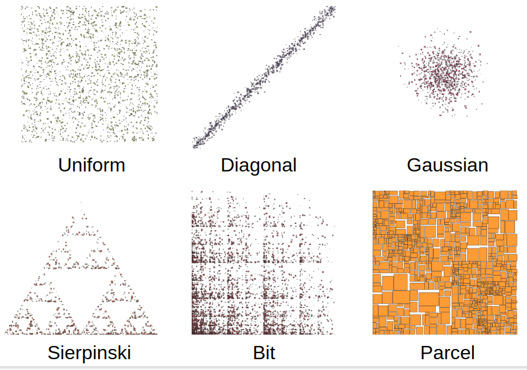

# SpiderWeb: A Spatial Interactive Data Generator on the Web
This repository provides a web-based generator for spatial data based on the award-winning Spatial Data Generator, which was presented in 1st ACM SIGSPATIAL International Workshop on Spatial Gems (SpatialGems 2019, https://www.spatialgems.net/).
The paper received the best paper award on that year. This web demo is based on a Python implementation. SpiderWeb is publicly accessible at [https://spider.cs.ucr.edu]. This demo was published in ACM SIGSPATIAL 2020. If you use Spider, please cite our paper below.

Puloma Katiyar, Tin Vu, Ahmed Eldawy, Sara Migliorini, and Alberto Belussi. 2020. SpiderWeb: A Spatial Data Generator on the Web. In Proceedings of the 28th International Conference on Advances in Geographic Information Systems (SIGSPATIAL '20). Association for Computing Machinery, New York, NY, USA, 465–468. DOI: [https://doi.org/10.1145/3397536.3422351]

## How to use it?
Check our [YouTube video](https://youtu.be/h0xCG6Swdqw) on how to use SpiderWeb. You can directly download the generated data from SpiderWeb or you can get a command line that generates the data using the enclosed Python implementation.

## Sample
There are six kinds of supported distribution. Please feel free to contact us if you want to have other spatial distributions.



Here are some links to some sample data.

- [1000 random rectangles in the world space](http://spider.cs.ucr.edu/?P&1000&2&&0.2&0.5&360,0,-180,0,180,-90)
- [1M random points around Los Angeles area](http://spider.cs.ucr.edu/?G&1000000&2&&point&2,0,-35,0,2,-119)
- [Reversely correlated points (x = -y)](http://spider.cs.ucr.edu/?D&500&2&2&point&0.2&0.2&-2,0,1,0,2,-1)

## Web demonstration
Spider is deployed as a web application at [https://spider.cs.ucr.edu] where you can visualize and download the datasets.

## Command line interface (CLI)
<div id="cli"></div>
Make sure that Python3 is installed. Download the [generator.py](html/cgi/generator.py) file and run it using the following command.
```shell
python3 generator.py <distribution> <cardinality> <dimensions> [geometry] [parameters]
```
The parameters are generally specified as a set of `key=value` pairs. The possible keys and their usage is described below.

- *distribution*: {uniform, diagonal, gaussian, parcel, bit, sierpinski}
- *cardinality*: Number of geometries to generate
- *dimensions*: Number of dimensions in generated geometries
- *geometry*: {point, box}. If geometry type is `box` and the distribution is NOT `parcel`, you have to specify the maxsize property
- *maxsize*: maximum size along each dimension (before transformation), e.g., 0.2,0.2 (no spaces)
- *percentage*: (for diagonal distribution) the percentage of records that are perfectly on the diagonal
- *buffer*: (for diagonal distribution) the buffer around the diagonal that additional points can be in
- *srange*: (for parcel distribution) the split range [0.0, 1.0]
- *dither*: (for parcel distribution) the amound of noise added to each record as a perctange of its initial size [0.0, 1.0]
- *affinematrix*: (optional) values of the affine matrix separated by comma. Number of expected values is d*(d+1) where d is the number of dimensions
- *compress*: (optional) { bz2 }
- *format*: output format { csv, wkt, geojson }
[affine matrix] (Optional) Affine matrix parameters to apply to all generated geometries

## Instructions to install on Apache Tomcat as a web service
### Prerequisites
1. Python3
2. Java Runtime Environment (JRE)

### Steps
1. Install [Apache Tomcat](https://tomcat.apache.org/download-90.cgi). Assume it is installed to `$CATALINA_HOME`
2. Enable [CGI scripting](http://tomcat.apache.org/tomcat-9.0-doc/cgi-howto.html). Edit `$CATALINA_HOME/conf/web.xml`. Uncomment the following sections and modify the configuration as shown:
```xml
<servlet-mapping>
    <servlet-name>cgi</servlet-name>
    <url-pattern>/spider/cgi/*</url-pattern>
</servlet-mapping>
...
<servlet>
    <servlet-name>cgi</servlet-name>
    <servlet-class>org.apache.catalina.servlets.CGIServlet</servlet-class>
    <init-param>
        <param-name>cgiPathPrefix</param-name>
        <param-value>WEB-INF/cgi</param-value>
    </init-param>
    <load-on-startup>5</load-on-startup>
</servlet>
```
3. Edit `$CATALINA_HOME/conf/context.xml` and add `privileged="true"` at the `<Context>` element so that it looks as follows.
```xml
<Context privileged="true">
...
</Context>
```
4. Copy the `html` directory from the source code to `$CATALINA_HOME/webapps/ROOT/spider`.
You can do that by running the following command at the source root `rsync -av html/ $CATALINA_HOME/webapps/ROOT/spider`
5. Copy the `html/cgi/generator.py` file to `$CATALINA_HOME/webapps/ROOT/WEB-INF/cgi/generator.py`. You can do that by running the command `rsync -av html/cgi/ $CATALINA_HOME/webapps/ROOT/WEB-INF/cgi`
6. Restart Tomcat server.
7. Open your browser and navigate to [http://localhost:8080/spider/]